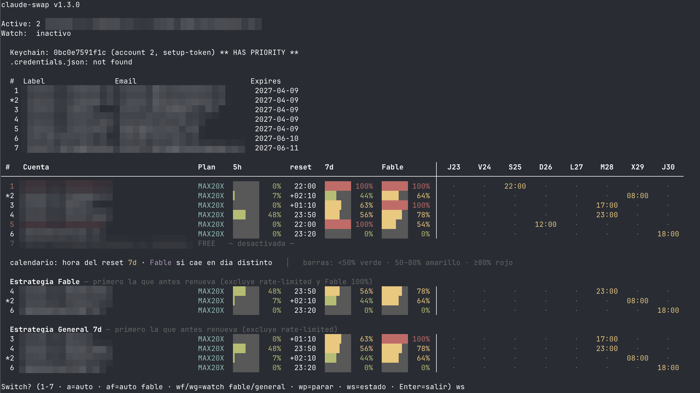

# claude-swap

Rotate between multiple Claude Max accounts in Claude Code — with a live
dashboard of every account's 5h / 7d / Fable limits, a renewal calendar,
swap strategies, and an optional watcher that rotates for you before you
hit the wall.



<details>
<summary>Plain-text example</summary>

```
$ claude-swap check

claude-swap v1.4.0

Active: 2 (Work / me@work.com)
Watch:  RUNNING (fable, PID 63012) — watching #2 — last probe 22:05: 5h 8% · 7d 44% · Fable 65%

 #   Account       Plan    5h           reset   7d           Fable       │ Th23   Fr24   Sa25   Su26   Mo27   Tu28   We29   Th30
─────────────────────────────────────────────────────────────────────────┼────────────────────────────────────────────────────────
  1  Personal      MAX20X  ░░░░░░   0%   20:30  ██████ 100%  ██████ 100% │   ·      ·    22:00    ·      ·      ·      ·      ·
 *2  Work          MAX20X  █▊░░░░  30%   21:10  ██▋░░░  43%  ███▊░░  62% │   ·      ·      ·      ·      ·      ·    08:00    ·
  3  Side Project  MAX20X  ░░░░░░   0%  +01:10  ███▊░░  63%  ██████ 100% │   ·      ·      ·      ·      ·    17:00    ·      ·
  4  Old Account   FREE   — disabled —

  calendar: 7d reset time · Fable when it falls on a different day   │   bars: <50% green · 50–80% yellow · ≥80% red

  Fable strategy — soonest renewal first (excludes rate-limited and Fable 100%)
 *2  Work          MAX20X  █▊░░░░  30%   21:10  ██▋░░░  43%  ███▊░░  62% │   ·      ·      ·      ·      ·      ·    08:00    ·

  General 7d strategy — soonest renewal first (excludes rate-limited)
  3  Side Project  MAX20X  ░░░░░░   0%  +01:10  ███▊░░  63%  ██████ 100% │   ·      ·      ·      ·      ·    17:00    ·      ·
 *2  Work          MAX20X  █▊░░░░  30%   21:10  ██▋░░░  43%  ███▊░░  62% │   ·      ·      ·      ·      ·      ·    08:00    ·
```

</details>

## Why

Claude Max subscribers hit rate limits on 5-hour and 7-day windows, and
each model (like Fable) has its own weekly counter on top. If you have
several accounts, switching with `claude login` every time is slow and
disruptive — and you never know *which* account is the smart one to
switch to.

`claude-swap` keeps a long-lived token per account, swaps credentials in
one command, shows every limit graphically, and can rotate automatically
when the active account runs dry.

## Requirements

- **macOS** or **Linux**
- **Python 3** (pre-installed on macOS)
- **Claude Code** installed
- One or more **Claude Max** accounts
- Optional, for the Fable % / plan columns via Chrome:
  `pip3 install --user browser_cookie3`

---

## Onboarding — from zero to dashboard

### 1. Install

```bash
curl -fsSL https://raw.githubusercontent.com/kokoima/claude-swap/main/install.sh | sh
```

or clone and install:

```bash
git clone https://github.com/kokoima/claude-swap
cd claude-swap && make install
```

### 2. Collect a setup token per account

A *setup token* is a long-lived credential (1 year) generated by Claude
Code itself — it works like being logged in, without re-authenticating.
You need one per account:

```bash
claude-swap init        # guided setup: accounts, sessionKeys and watcher
```

For **each** account, in another terminal:

1. `claude login` — sign in with that account (browser flow)
2. `claude setup-token` — prints a token starting with `sk-ant-`
3. Paste it into the `claude-swap init` / `claude-swap add` prompt
4. **Set the label and, importantly, the email** — the email is how
   `keys-sync` matches claude.ai cookies to accounts later

Repeat `claude login` + `claude setup-token` for the next account (each
login replaces the previous one — that's fine, the tokens keep working).
When you're done, `claude-swap 1` (or any number) to settle on the
account you want active.

### 3. Enable the Fable % and plan columns (sessionKeys)

The Anthropic API only exposes the unified 5h/7d windows. The per-model
**Fable weekly counter** and your **subscription tier** come from
claude.ai's own web API, which needs the `sessionKey` cookie of a
logged-in claude.ai session. Two ways to feed it:

**Option A — automatic, recommended: Chrome profiles + `keys-sync`**

1. Keep one Chrome profile per account logged into https://claude.ai
   (any profiles — matching is by email, not by profile name).
2. `pip3 install --user browser_cookie3`
3. Run:

   ```bash
   claude-swap keys-sync
   ```

   It scans every Chrome profile's cookie store (through a temp copy, so
   Chrome can stay open), validates each session against claude.ai, and
   assigns each cookie to the account whose **email** matches. On macOS
   the first run may trigger a Keychain prompt ("Chrome Safe Storage") —
   that's browser_cookie3 decrypting Chrome's cookies; allow it.

Cookies expire every few weeks. When the Fable column shows `-`, log
claude.ai back in on that Chrome profile and run `keys-sync` again — it
reports which sessions are `EXPIRED` and which accounts it updated.

**Option B — manual: DevTools**

On claude.ai logged in with the account: DevTools → Application →
Cookies → `https://claude.ai` → copy the `sessionKey` value (starts with
`sk-ant-sid`), then:

```bash
claude-swap key <n>
```

`init` chains the next two steps for you (cookie scan and watcher) — the
sections below explain what they do and how to redo them later.

### 4. First look

```bash
claude-swap check      # full dashboard
claude-swap            # interactive: dashboard + switch prompt
```

### 5. Optional: hands-free switching

```bash
claude-swap watch start fable
```

See [watch mode](#watch-mode--automatic-switching) below.

---

## Daily usage

```bash
claude-swap            # interactive menu (see shortcuts below)
claude-swap 2          # switch to account 2
claude-swap auto       # switch to the best account (general strategy)
claude-swap af         # switch to the best account for Fable
claude-swap check      # dashboard without switching
```

Interactive menu shortcuts: a number switches account, `a` = auto,
`af` = auto fable, `wf`/`wg` = start watcher (fable/general), `wp` =
stop watcher, `ws` = watcher status, Enter = exit.

## Reading the dashboard

- **Plan** — subscription tier (MAX20X / MAX5X / PRO / FREE), cached in
  the store, refreshed by `keys-sync`.
- **5h / 7d / Fable** — color bars: green <50%, yellow 50–80%, red ≥80%.
  `-` means no data (usually an expired sessionKey for Fable).
- **reset** — exact time the 5h window resets (`+HH:MM` = tomorrow).
- **Calendar** — 8 days starting today; each cell shows the time the
  **7d** limit renews (yellow), and the **Fable** renewal in magenta when
  it falls on a different day.
- **Strategies** — the same rows reordered: consume first the account
  whose weekly limit renews soonest (what you spend there comes back
  first); % is only the tiebreaker. Rate-limited and disabled accounts
  are excluded; the Fable strategy also excludes accounts at 100% Fable.

## Watch mode — automatic switching

```bash
claude-swap watch start fable     # or: general
claude-swap watch status
claude-swap watch stop
```

A small daemon (plain process + pidfile, log in
`~/.claude/claude-swap-watch.log`) probes **only the active account** on
an adaptive schedule — every 10 min below 80%, every 3 min at 80–95%,
every minute above 95%. Consumption is negligible: one ~5-token Haiku
call per probe, and the Fable check costs zero tokens (claude.ai cookie
API).

- At **95%** it sends a macOS notification (pre-warning, once per crossing).
- At **99%** (or on rate-limit) it probes the rest, picks the best target
  with the chosen strategy (soonest weekly renewal first), rotates, and
  notifies. If everything is exhausted it tells you and keeps retrying.
- After rotating it watches the new active account automatically.

On Linux there are no notifications — everything still lands in the log.

## Commands

| Command | Description |
|---------|-------------|
| `claude-swap` | Interactive: dashboard + switch prompt |
| `claude-swap <n>` | Switch to account N |
| `claude-swap status` | Current account + watcher state |
| `claude-swap check` | Full dashboard (limits, calendar, strategies) |
| `claude-swap auto [fable\|general]` | Auto-switch to the best available account |
| `claude-swap af` | Alias for `auto fable` |
| `claude-swap watch start [fable\|general]` | Background auto-switcher (99% trigger, 95% pre-warning) |
| `claude-swap watch stop` | Stop the watcher |
| `claude-swap watch status` | Watcher state + last probe + log tail |
| `claude-swap add` | Add a new account |
| `claude-swap remove <n>` | Remove an account |
| `claude-swap key <n>` | Set a claude.ai sessionKey manually |
| `claude-swap keys-sync` | Auto-import sessionKeys from Chrome profiles (by email) |
| `claude-swap disable <n>` / `enable <n>` | Exclude/re-include an account (free accounts, etc.) |
| `claude-swap init` | Guided first-time setup (accounts → sessionKeys → watcher) |

Short aliases: `s` (status), `c` (check), `a` (auto), `ks` (keys-sync).

## How it works

Claude Code stores credentials in two places:

1. **macOS Keychain** (`Claude Code-credentials`) — has priority
2. **`~/.claude/.credentials.json`** — fallback

When you run `claude-swap <n>`, it:

1. Deletes the Keychain entry (macOS only) so it doesn't override the file
2. Writes the selected setup token to `~/.claude/.credentials.json`
3. Clears `oauthAccount` from `~/.claude.json` (Claude Code repopulates it)
4. Updates the active account in `~/.claude/claude-swap.json`

Data sources for the dashboard:

- **5h/7d % and resets** — response headers of a minimal Haiku request
  to `api.anthropic.com` (one per account per check).
- **Fable % / renewal and plan tier** — claude.ai's
  `/api/organizations/<org>/usage` and `/api/bootstrap`, authenticated
  with the account's `sessionKey` cookie. Zero token cost.

## Storage & security

Everything lives locally under `~/.claude/`:

| File | Contents |
|------|----------|
| `claude-swap.json` | Accounts: labels, emails, setup tokens, sessionKeys, cached org/plan (`600` perms) |
| `claude-swap-watch.pid` / `.state` / `.log` | Watcher process id, last probe, log |

Tokens are only ever sent to `api.anthropic.com`; sessionKeys only to
`claude.ai`. Nothing goes to any third party.

## Troubleshooting

**Fable column shows `-`** — the sessionKey is missing or expired. Log
claude.ai back in on a Chrome profile with that account and run
`claude-swap keys-sync` (or paste one with `key <n>`).

**`keys-sync` finds the cookie but doesn't update my account** — matching
is by the account's **email** field in the store. Make sure it equals the
claude.ai login email (re-add the account or edit
`~/.claude/claude-swap.json`).

**`keys-sync` says "browser_cookie3 missing"** —
`pip3 install --user browser_cookie3`.

**A check row shows `permission_error`** — that account's setup token
can't call the API (revoked, or the account has no active Max
subscription). Regenerate it with `claude setup-token`, or
`claude-swap disable <n>` if it's a free account.

**`Watch: stale pidfile`** — the watcher died (e.g. reboot). Run
`claude-swap watch stop` to clean up, then `watch start` again.

**Notifications don't appear** — macOS only, and terminal/osascript
notifications must be allowed in System Settings → Notifications.

## FAQ

**Is this safe?** Yes — see [Storage & security](#storage--security).
Everything is local, `600`-permissioned, and only talks to Anthropic
endpoints.

**Do I need to restart Claude Code after a swap?** No. New sessions
automatically use the swapped account, and running sessions pick it up
as well once they refresh credentials.

**What's a setup token?** A long-lived OAuth token generated by
`claude setup-token`. It lasts 1 year and works like `claude login`,
without needing to re-authenticate.

**Does polling waste my quota?** The watcher probes only the active
account with a ~5-token Haiku call (adaptive, 1–10 min). That's a few
thousand tokens per day at worst — noise compared to any real session.
The Fable probe costs zero tokens.

**Can I use this with the Claude desktop app?** No — `claude-swap` only
manages Claude Code (CLI) credentials.

## Uninstall

```bash
make uninstall
# or
rm ~/.local/bin/claude-swap
```

Your accounts are preserved in `~/.claude/claude-swap.json`. Delete it
manually (plus `claude-swap-watch.*`) for a clean removal.

## License

MIT
