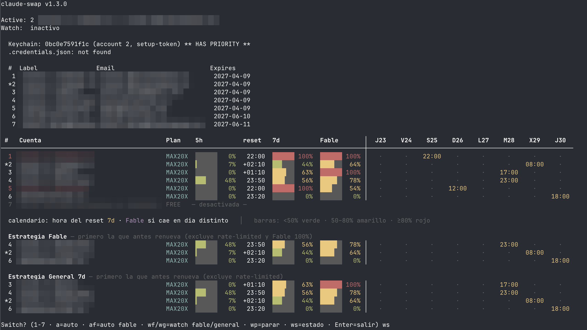

# claude-swap

Rotate between multiple Claude Max accounts in Claude Code — with a live
dashboard of every account's 5h / 7d / Fable limits, a renewal calendar,
swap strategies, and an optional watcher that rotates for you before you
hit the wall.



<details>
<summary>Plain-text example</summary>

```
$ claude-swap check

claude-swap v1.7.0

Active: 2 (Work / me@work.com)
Watch:  RUNNING (fable, PID 63012) — watching #2 — last probe 22:05: 5h 8% · 7d 44% · Fable 65%

 #   Account       Plan    5h           reset   7d           Fable        Rst │ Th23   Fr24   Sa25   Su26   Mo27   Tu28   We29   Th30
──────────────────────────────────────────────────────────────────────────────┼────────────────────────────────────────────────────────
  1  Personal      MAX20X  ░░░░░░   0%   20:30  ██████ 100%  ██████ 100%    1 │   ·      ·    22:00    ·      ·      ·      ·      ·
 *2  Work          MAX20X  █▊░░░░  30%   21:10  ██▋░░░  43%  ███▊░░  62%    0 │   ·      ·      ·      ·      ·      ·    08:00    ·
  3  Side Project  MAX20X  ░░░░░░   0%  +01:10  ███▊░░  63%  ██████ 100%    - │   ·      ·      ·      ·      ·    17:00    ·      ·
  4  Old Account   FREE   — disabled —

  calendar: 7d reset time · Fable when it falls on a different day   │   bars: <50% green · 50–80% yellow · ≥80% red   │   Rst: free limit resets left (? = no valid cookie)
  Plan ending: #1 Personal MAX20X cancelled, ends Fri 02 Oct 11:06 (in 3d)
  Free limit resets: #1 Personal ×1 · until Fri 02 Oct 11:06 (in 3d) — plan ends · spend one: claude-swap reset <n>

  Fable strategy — soonest renewal first (excludes rate-limited and Fable 100%)
 *2  Work          MAX20X  █▊░░░░  30%   21:10  ██▋░░░  43%  ███▊░░  62%    0 │   ·      ·      ·      ·      ·      ·    08:00    ·

  General 7d strategy — soonest renewal first (excludes rate-limited)
  3  Side Project  MAX20X  ░░░░░░   0%  +01:10  ███▊░░  63%  ██████ 100%    - │   ·      ·      ·      ·      ·    17:00    ·      ·
 *2  Work          MAX20X  █▊░░░░  30%   21:10  ██▋░░░  43%  ███▊░░  62%    0 │   ·      ·      ·      ·      ·      ·    08:00    ·
```

</details>

## Why

Claude Max subscribers hit rate limits on 5-hour and 7-day windows, and
each model (like Fable) has its own weekly counter on top. If you have
several accounts, switching with `claude login` every time is slow and
disruptive — and you never know *which* account is the smart one to
switch to.

`claude-swap` keeps a long-lived token per account, swaps credentials in
one command, shows every limit graphically, and can rotate automatically
when the active account runs dry.

## Requirements

- **macOS** or **Linux**
- **Python 3** (pre-installed on macOS)
- **Claude Code** installed
- One or more **Claude Max** accounts
- Recommended, so the dashboard reads your usage for free (see below):
  `pip3 install --user browser_cookie3`

---

## Onboarding — from zero to dashboard

### 1. Install

```bash
curl -fsSL https://raw.githubusercontent.com/kokoima/claude-swap/main/install.sh | sh
```

or clone and install:

```bash
git clone https://github.com/kokoima/claude-swap
cd claude-swap && make install
```

### 2. Collect a setup token per account

A *setup token* is a long-lived credential (1 year) generated by Claude
Code itself — it works like being logged in, without re-authenticating.
You need one per account:

```bash
claude-swap init        # guided setup: accounts, sessionKeys and watcher
```

For **each** account, in another terminal:

1. `claude login` — sign in with that account (browser flow)
2. `claude setup-token` — prints a token starting with `sk-ant-`
3. Paste it into the `claude-swap init` / `claude-swap add` prompt
4. **Set the label and, importantly, the email** — the email is how
   `keys-sync` matches claude.ai cookies to accounts later

Repeat `claude login` + `claude setup-token` for the next account (each
login replaces the previous one — that's fine, the tokens keep working).
When you're done, `claude-swap 1` (or any number) to settle on the
account you want active.

### 3. Free usage readings (sessionKeys)

Every figure in the dashboard — the 5h and 7d windows, each per-model
weekly counter such as **Fable**, and your **subscription tier** — comes
from claude.ai's own web API in a single request per account, which
needs the `sessionKey` cookie of a logged-in claude.ai session. That
request costs **no tokens**.

An account with no valid cookie falls back to a minimal billed API call
that reads the rate-limit response headers. It still yields 5h and 7d,
but no per-model counter, and it spends a handful of tokens per check.
So cookies are what make the dashboard both complete and free.

> Don't bother with `api.anthropic.com/api/oauth/usage`: it requires the
> `user:profile` scope that `claude setup-token` does not mint, and it
> answers `429` with an hour-long `retry-after` even for a token that
> does carry the scope.

Two ways to feed the cookie:

**Option A — automatic, recommended: Chrome profiles + `keys-sync`**

1. Keep one Chrome profile per account logged into https://claude.ai
   (any profiles — matching is by email, not by profile name).
2. `pip3 install --user browser_cookie3`
3. Run:

   ```bash
   claude-swap keys-sync
   ```

   It scans every Chrome profile's cookie store (through a temp copy, so
   Chrome can stay open), validates each session against claude.ai, and
   assigns each cookie to the account whose **email** matches. On macOS
   the first run may trigger a Keychain prompt ("Chrome Safe Storage") —
   that's browser_cookie3 decrypting Chrome's cookies; allow it.

Cookies expire every few weeks. When a row falls back to `-` columns or
stops showing its per-model counter, log
claude.ai back in on that Chrome profile and run `keys-sync` again — it
reports which sessions are `EXPIRED` and which accounts it updated, plus
any account whose stored cookie no logged-in profile backs any more (the
usual sign that the one in the store has quietly expired).

**Option B — manual: DevTools**

On claude.ai logged in with the account: DevTools → Application →
Cookies → `https://claude.ai` → copy the `sessionKey` value (starts with
`sk-ant-sid`), then:

```bash
claude-swap key <n>
```

`init` chains the next two steps for you (cookie scan and watcher) — the
sections below explain what they do and how to redo them later.

### 4. First look

```bash
claude-swap check      # full dashboard
claude-swap            # interactive: dashboard + switch prompt
```

### 5. Optional: hands-free switching

```bash
claude-swap watch start fable
```

See [watch mode](#watch-mode--automatic-switching) below.

---

## Daily usage

```bash
claude-swap            # interactive menu (see shortcuts below)
claude-swap 2          # switch to account 2
claude-swap auto       # switch to the best account (general strategy)
claude-swap af         # switch to the best account for Fable
claude-swap check      # dashboard without switching
claude-swap reset 3    # spend account 3's free limit reset (asks first)
```

Interactive menu shortcuts: a number switches account, `a` = auto,
`af` = auto fable, `wf`/`wg` = start watcher (fable/general), `wp` =
stop watcher, `ws` = watcher status, Enter = exit.

## Reading the dashboard

- **Plan** — subscription tier (MAX20X / MAX5X / PRO / FREE), cached in
  the store. `check` re-reads it once a day, and straight away when the
  usage reply contradicts it (windows on a FREE plan, none on a paid
  one); a change prints a `Plan changed: #4 … MAX20X → FREE` line.
  A **yellow** plan is about to stop: a `Plan ending: … cancelled, ends
  Fri 02 Oct 11:06 (in 3d)` line gives the cancellation date claude.ai's
  billing page shows, and `Plan downgrade: … MAX20X → PRO on …` a booked
  step down. Both are read daily from `/subscription_details`.
- **5h / 7d / Fable** — color bars: green <50%, yellow 50–80%, red ≥80%.
  `-` means no data: an expired sessionKey, or a plan with no such
  window.
- **reset** — exact time the 5h window resets (`+HH:MM` = tomorrow).
- **Rst** — free limit resets left on the account (green). `0` = all
  spent, `-` = the plan is not offered any, `?` = unknown because the
  account has no working sessionKey. When any account holds one, a
  `Free limit resets:` line lists them and when they lapse (yellow under
  72 h, red under 24 h) — the plan's end date when that comes first,
  marked `— plan ends`. See [free limit resets](#free-limit-resets).
- **Calendar** — 8 days starting today; each cell shows the time the
  **7d** limit renews (yellow), and the **Fable** renewal in magenta when
  it falls on a different day.
- **Strategies** — the same rows reordered: consume first the account
  whose weekly limit renews soonest (what you spend there comes back
  first); % is only the tiebreaker. Rate-limited and disabled accounts
  are excluded; the Fable strategy also excludes accounts at 100% Fable.

## Watch mode — automatic switching

```bash
claude-swap watch start fable     # or: general
claude-swap watch status
claude-swap watch stop
```

A small daemon (plain process + pidfile, log in
`~/.claude/claude-swap-watch.log`) probes **every account** each cycle,
which is free over the cookie, so a rotation can pick its target from
figures it already has. The active account sets the pace on an adaptive
schedule — every 10 min below 80%, every 3 min at 80–95%,
every minute above 95%. Probes read claude.ai with the cookie and cost
zero tokens; only an account without a working cookie falls back to a
~5-token Haiku call.

- At **95%** it sends a macOS notification (pre-warning, once per crossing).
- At **99%** (or on rate-limit) it probes the rest, picks the best target
  with the chosen strategy (soonest weekly renewal first), rotates, and
  notifies. If everything is exhausted it tells you and keeps retrying —
  and names any account that still holds a free limit reset.
- After rotating it watches the new active account automatically.
- An unspent free limit reset gets a reminder 72 h and 24 h before it
  lapses. The watcher never spends one itself: that is irreversible, and
  what it is worth depends on timing.

On Linux there are no notifications — everything still lands in the log.

## Commands

| Command | Description |
|---------|-------------|
| `claude-swap` | Interactive: dashboard + switch prompt |
| `claude-swap <n>` | Switch to account N |
| `claude-swap status` | Current account + watcher state |
| `claude-swap check` | Full dashboard (limits, calendar, strategies) |
| `claude-swap auto [fable\|general]` | Auto-switch to the best available account |
| `claude-swap af` | Alias for `auto fable` |
| `claude-swap watch start [fable\|general]` | Background auto-switcher (99% trigger, 95% pre-warning) |
| `claude-swap watch stop` | Stop the watcher |
| `claude-swap watch status` | Watcher state + last probe + log tail |
| `claude-swap reset <n>` | Spend account N's free limit reset (shows what it clears, asks for `yes`) |
| `claude-swap add` | Add a new account |
| `claude-swap remove <n>` | Remove an account |
| `claude-swap key <n>` | Set a claude.ai sessionKey manually |
| `claude-swap keys-sync` | Auto-import sessionKeys from Chrome profiles (by email) |
| `claude-swap disable <n>` / `enable <n>` | Exclude/re-include an account (free accounts, etc.) |
| `claude-swap init` | Guided first-time setup (accounts → sessionKeys → watcher) |

Short aliases: `s` (status), `c` (check), `a` (auto), `ks` (keys-sync).

## How it works

Claude Code stores credentials in two places:

1. **macOS Keychain** (`Claude Code-credentials`) — has priority
2. **`~/.claude/.credentials.json`** — fallback

When you run `claude-swap <n>`, it:

1. Deletes the Keychain entry (macOS only) so it doesn't override the file
2. Writes the selected setup token to `~/.claude/.credentials.json`
3. Clears `oauthAccount` from `~/.claude.json` (Claude Code repopulates it)
4. Updates the active account in `~/.claude/claude-swap.json`

Data sources for the dashboard:

- **Everything per account** — one request to claude.ai's
  `/api/organizations/<org>/usage?cedar_ember=1&skip_spend=1`,
  authenticated with the account's `sessionKey` cookie: 5h, 7d, every
  per-model window (Fable) and the free limit resets. Zero token cost.
- **Plan tier** — `/api/organizations` (daily, or when the usage reply
  contradicts it) and `/api/bootstrap` during `keys-sync`.
- **Fallback** — an account with no working cookie gets 5h/7d from the
  response headers of a minimal Haiku request to `api.anthropic.com`.

### Free limit resets

Anthropic occasionally grants subscription plans a free **limit reset**
(for example, one per Pro/Max account at the Opus 5.5 launch). Spending
it empties the windows it lists (5h and 7d; the `seven_day_overage_included`
window it also clears tracks the Fable counter) straight away. The weekly
renewal day does not move, you do not need to be at a limit, and it
cannot be undone. Unspent resets lapse on the date shown, and are lost
earlier if the plan is cancelled or downgraded first — `check`, the
watcher's reminders and `reset <n>` all count down to whichever comes
first. Anthropic's help page: [What is a limit reset?](https://support.claude.com/en/articles/17007452-what-is-a-limit-reset)

- claude.ai only fills the `cedar_ember` block of the usage reply when
  asked with `cedar_ember=1`; that is how `check` and the watcher read it.
- `claude-swap reset <n>` re-reads that block, shows the grant, what it
  clears and when the 7d window would renew anyway, warns when a reset
  would buy little (7d renewing within 48 h, or the account far from its
  limits) and, after you type `yes`, posts
  `{"program": "cedar_ember", "grant_id": …, "request_id": …}` to
  `/api/organizations/<org>/reset_rate_limits` — what claude.ai's own
  "Reset for free" button sends. It then re-reads the usage to confirm,
  so a lost reply is not reported as a failure.
- Best use: an account at its limit with days left until its weekly
  renewal, before the grant lapses.

## Storage & security

Everything lives locally under `~/.claude/`:

| File | Contents |
|------|----------|
| `claude-swap.json` | Accounts: labels, emails, setup tokens, sessionKeys, cached org/plan and plan end date (`600` perms) |
| `claude-swap-watch.pid` / `.state` / `.log` | Watcher process id, last probe, log |
| `claude-swap-usage.json` | Last usage snapshot for every account, rewritten by `check` and by the watcher. Percentages, free resets left, labels — no credentials — meant for read-only consumers such as a status line |

Tokens are only ever sent to `api.anthropic.com`; sessionKeys only to
`claude.ai`. Nothing goes to any third party.

## Troubleshooting

**Fable column shows `-`, or Rst shows `?`** — the sessionKey is missing
or expired. Log claude.ai back in on a Chrome profile with that account
and run `claude-swap keys-sync` (or paste one with `key <n>`). When a
Chrome profile is named after the account's email, `keys-sync` names it.

**Plan column is wrong** — it is cached. `check` corrects it within a
day (sooner for a drop to FREE), and `keys-sync` corrects it at once and
says so.

**`keys-sync` finds the cookie but doesn't update my account** — matching
is by the account's **email** field in the store. Make sure it equals the
claude.ai login email (re-add the account or edit
`~/.claude/claude-swap.json`).

**`keys-sync` says "browser_cookie3 missing"** —
`pip3 install --user browser_cookie3`.

**A check row shows `permission_error`** — that account's setup token
can't call the API (revoked, or the account has no active Max
subscription). Regenerate it with `claude setup-token`, or
`claude-swap disable <n>` if it's a free account.

**`Watch: stale pidfile`** — the watcher died (e.g. reboot). Run
`claude-swap watch stop` to clean up, then `watch start` again.

**Notifications don't appear** — macOS only, and terminal/osascript
notifications must be allowed in System Settings → Notifications.

## FAQ

**Is this safe?** Yes — see [Storage & security](#storage--security).
Everything is local, `600`-permissioned, and only talks to Anthropic
endpoints.

**Do I need to restart Claude Code after a swap?** No. New sessions
automatically use the swapped account, and running sessions pick it up
as well once they refresh credentials.

**What's a setup token?** A long-lived OAuth token generated by
`claude setup-token`. It lasts 1 year and works like `claude login`,
without needing to re-authenticate.

**Does polling waste my quota?** No. Every probe reads claude.ai with
the account's cookie, which costs zero tokens. Only an account with no
working cookie falls back to a ~5-token Haiku call, a few thousand tokens
per day at worst — noise compared to any real session.

**Can I use this with the Claude desktop app?** No — `claude-swap` only
manages Claude Code (CLI) credentials.

## Uninstall

```bash
make uninstall
# or
rm ~/.local/bin/claude-swap
```

Your accounts are preserved in `~/.claude/claude-swap.json`. Delete it
manually (plus `claude-swap-watch.*`) for a clean removal.

## License

MIT
